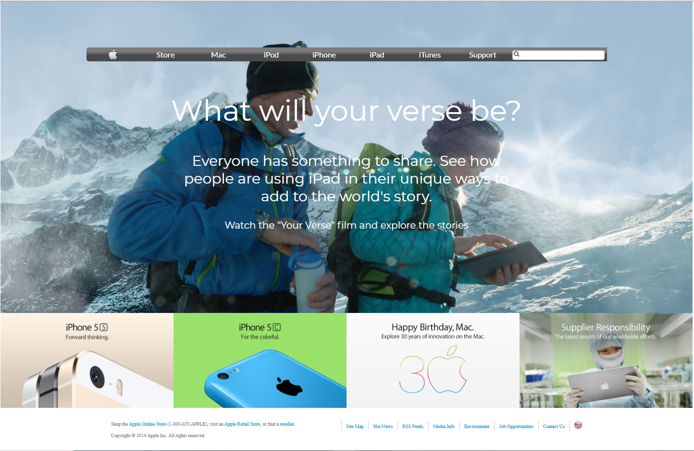

# Building with Backgrounds and Gradients

> This project consists of building a webpage using images as a background and adding gradients to elements. The goal is to make a clone of old an old version of the Apple website webpage.

## Built With

- HTML5, CSS.

## Live Demo

[Live Demo Link](https://rawcdn.githack.com/abdelp/building-with-backgrounds-and-gradients/241a7534481d5b5d6563967d1d67bc1a5f2f2304/index.html)

## Author

👤 **Abdel Pérez**

- Github: [@abdelp](https://github.com/abdelp/)
- Twitter: [@abdelperez11](https://twitter.com/abdelperez11)
- Linkedin: [Abdel Pérez](https://www.linkedin.com/in/abdel-p%C3%A9rez-t%C3%A9llez-72b2aa153/)

## 🤝 Contributing

Contributions, issues and feature requests are welcome!

Feel free to check the [issues page](issues/).

## Show your support

Give a ⭐️ if you like this project!

## 📝 License

This project is [MIT](lic.url) licensed.
